# SOF-MARL: A Multi-Agent Reinforcement-Learning Prototype for Autonomous SME Treasury Management

**Technical Report**

Author: Prince Enyiorji\
Version: 1.0 (filled from the actual run; see section 8 for reproducibility)\
Date: 2026-07-21\
Code snapshot: not under version control at time of writing (local working directory); see section 8\
Data snapshot: SBA 7(a) FOIA, file `FOIA_7a_FY2010_FY2019_asof_260331.csv`, as of March 31, 2026, 545,753 rows

> The treasury environment is a calibrated simulation and is labeled as such wherever
> it appears; the credit-risk model is trained on real public data.

---

## Abstract

This report documents a proof-of-concept implementation of the self-optimizing,
cloud-native autonomous finance architecture for small and medium enterprises (SMEs)
proposed in Enyiorji (2025). The system uses multi-agent reinforcement learning
(MARL) to manage an SME's weekly treasury decisions across four functions: liquidity
forecasting, credit-risk assessment, expenditure optimization, and capital allocation.
The credit-risk function is grounded in a supervised model trained on the U.S. Small
Business Administration (SBA) 7(a) public loan-outcome dataset, which achieves a
held-out ROC-AUC of 0.939 (95% CI 0.936-0.942); we investigated this figure precisely
because it is unusually high, found its discrimination concentrated in loan
term/structure (removing that feature drops the AUC to 0.622), and cross-checked it
with a survival-analysis reframe that puts the snapshot's previously-excluded active
loans back in as right-censored observations -- which leaves discrimination essentially
unchanged (concordance index 0.928), indicating the strong performance is not primarily
a resolved-loan selection artifact, though it remains term-concentrated (section 5.1).
The four functions operate as
cooperating agents in a treasury environment calibrated to public U.S. small-business
statistics. We compare four control policies on identical, held-out evaluation
episodes: a rule-based heuristic, a single-agent controller, independent multi-agent RL
(IPPO), and coordinated multi-agent RL (MAPPO). Coordinated control (MAPPO) increased
the pre-registered combined treasury objective by 8.97-9.22 relative to every other
policy (mean over 5 training seeds, 100 shared evaluation episodes, paired Wilcoxon
signed-rank p < 0.001 for all three comparisons), and the qualitative result was
unchanged across six perturbations of three consequential calibration constants
(section 5.4). Under a separate, pre-registered adverse stress scenario (sharp
downturn, thin liquidity; section 5.5), the learned policies manage solvency markedly
better than the rule-based heuristic (breach rate 1.06% -> 0.00-0.08%), but on solvency
specifically coordination adds nothing over independent multi-agent RL (MAPPO and IPPO
tie at zero breaches) -- MAPPO's advantage is on capital efficiency and firm-value
growth, not solvency, which we state plainly. Across four stylized sector profiles
(section 5.6) the baseline coordinated policy transfers zero-shot to every sector with no
solvency breaches, and domain-randomized retraining does not improve on it at these
profile distances -- a null result we report as-is. We also document an engineering iteration that strengthens the
result: in an initial run the credit-risk agent collapsed to denying essentially every
exposure; we diagnosed the cause (a miscalibrated concentration penalty plus a delayed,
swamped reward), redesigned the credit reward, and retrained, after which the credit
agent learns a sensible risk threshold and the learned policies run credit books more
profitable than the rule-based baseline (approval precision ~0.97, portfolio yield net
of losses roughly double the baseline's; sections 5.3, 7). Because the credit exposures
are small-scale relative to the balance sheet, the MAPPO coordination advantage is
driven mainly by the liquidity and capital-allocation agents, which we state plainly.
We report interpretability (SHAP) for the credit model, the sensitivity analysis, this
and other limitations, and a full reproducibility statement.

---

## 1. Objective and scope

### 1.1 Goal
Demonstrate, with measured and reproducible results on public U.S. SME data, that the
MARL architecture in Enyiorji (2025) can be implemented and can manage an SME's
treasury, and test the paper's central claim that coordinated multi-agent control
outperforms non-coordinated and single-agent alternatives.

### 1.2 What this prototype is and is not
In scope: one representative SME profile class; a 52-week (one fiscal year) episode;
four cooperating agents; a real-data credit-risk model; a four-way policy comparison;
interpretability; sensitivity analysis.

Out of scope (stated as future work, not implied to exist): real firm or bank data
beyond the public SBA dataset; live or streaming deployment; a user interface;
regulatory certification or production MLOps; large-scale hyperparameter search.

### 1.3 Design basis
The architecture follows Enyiorji (2025), *Designing a Self-Optimizing Cloud-Native
Autonomous Finance System for SMEs Using Multi-Agent Reinforcement Learning*. This
report implements a scoped subset sufficient to test the core claim.

---

## 2. System architecture

The full technical specification -- state, dynamics, per-agent observation/action
spaces and rewards, and the credit-exposure integration -- lives in
`docs/ARCHITECTURE.md`; this section summarizes it.

- **Environment.** The SME treasury is modeled as a Markov game with one shared cash
  pool and four agents acting each week. State includes cash, receivables aging,
  payables schedule, revolving credit and term debt, seasonal revenue and expenses,
  pending credit exposures, reserve, and invested capital. Dynamics enforce an
  accounting identity every step (cash conservation), verified by unit tests.
- **Agents.** Liquidity forecasting, credit-risk assessment, expenditure
  optimization, capital allocation. Each has a defined observation slice, action
  space, and reward, and each was trained (not simplified or scripted) under all
  three learned policies. All four converge to non-trivial behavior. The credit-risk
  agent did so only after a reward redesign: in an initial run it collapsed to
  always-deny, which we diagnosed and fixed (immediate expected-value shaping +
  threshold concentration penalty; sections 4.2, 5.3, 7), after which it learns a
  sensible risk threshold.
- **Coordination.** A shared firm-level reward plus a centralized critic (MAPPO)
  provides the coordination signal; the independent baseline (IPPO) removes it. This
  isolates the value of coordination.

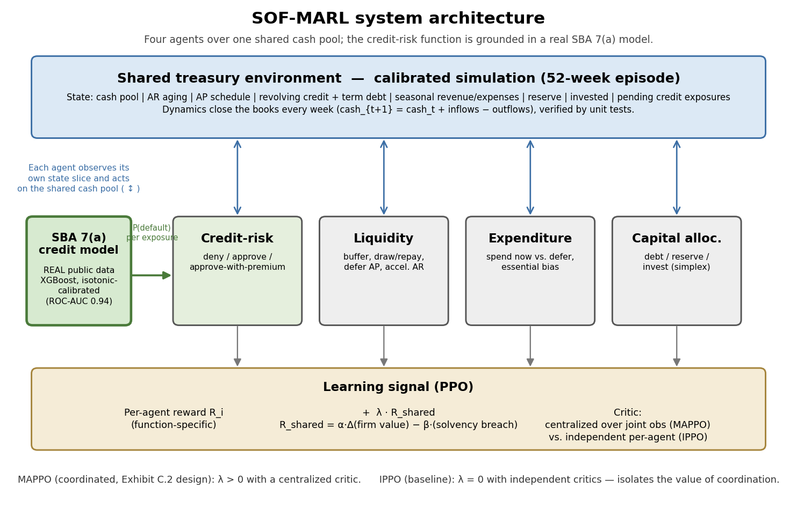

Figure 1 (`reports/figures/architecture.png`): the four agents acting on one shared
treasury environment, the real SBA 7(a) credit model feeding the credit-risk agent,
and the reward/critic structure that distinguishes IPPO (independent critics,
`lambda = 0`) from MAPPO (centralized critic over joint observations,
`lambda > 0`). Regenerated by `python scripts/make_architecture_diagram.py`. The
agent order shown is illustrative -- the credit-risk agent is drawn next to its
real-data source for clarity, not to imply an ordering in code.

---

## 3. Data

### 3.1 Real data: SBA 7(a) FOIA loan outcomes (credit-risk model)
- Source: SBA Open Data portal, 7(a) and 504 FOIA dataset (public-domain U.S.
  Government open data). https://data.sba.gov/en/dataset/7-a-504-foia
- Snapshot: file `FOIA_7a_FY2010_FY2019_asof_260331.csv`, as of March 31, 2026,
  545,753 rows, SHA-256
  `442cc3dbecb008010499cb3ac7a763f24220e0b43f7771ea1ac7cca869e419d9`.
- Target: charge-off (1) vs paid-in-full (0); unresolved statuses (`CANCLD`,
  `EXEMPT`, `COMMIT`) dropped, leaving 425,377 resolved loans. Class balance by
  split: fit 7.18% (n=255,904), calibration 8.51% (n=97,250), test 9.74%
  (n=72,221) charged off.
- Features: 132 total -- 10 numeric (loan/guaranteed amount, guaranty percentage,
  term, interest rate, jobs supported, approval fiscal year, revolver flag,
  collateral flag, franchise flag) plus 122 one-hot dummies over six categorical
  fields (2-digit NAICS sector, borrower state, business type, business age,
  fixed/variable rate, processing method). Leakage-checked against the FOIA data
  dictionary: fields populated only at or after resolution (`PaidInFullDate`,
  `ChargeOffDate`, `GrossChargeOffAmount`) are excluded by never being read from
  the raw file (`src/sof_marl/credit/build_dataset.py`, `RAW_USECOLS`), not merely
  dropped after loading.
- Split: time-based; fit on approval fiscal years <=2015, calibrate isotonic
  probabilities on 2016-2017 (never used for fitting), test on 2018-2019 (never
  touched until the final held-out metrics in section 5.1).

### 3.2 Calibration data: public statistics for the simulation
The treasury environment is a simulation calibrated to public statistics. Every
constant in `config/env.yaml` is sourced or explicitly tagged `assumption`; the
table below lists the constants with a direct public anchor. Constants without one
(revenue level and volatility, buffer stock sizes, collection curve, credit-line
limit, investment return, credit-exposure scaling, expenditure/ops-health rates,
accounts-payable schedule) are tagged `assumption` in `config/env.yaml` itself and
are not restated here; three of the most consequential are varied in the section
5.4 sensitivity analysis.

| Constant | Value used | Source |
|---|---|---|
| Median cash buffer days (`buffer_days_target`) | 27 days | JPMorgan Chase Institute, *Cash is King* (median buffer days across small firms) |
| Small-business revolving credit-line APR (`credit_line.apr`) | 11% | Representative small-business revolving rate; not pulled from a specific dated FRED series for this run -- flagged for verification against a current FRED pull before any filing use, per `docs/DATA.md` |
| Term-debt APR (`term_debt_apr`) | 9% | Representative small-business term-loan rate; same FRED-verification caveat as above |
| Loss given default (`loss_given_default_frac`) | 60% | Typical commercial-lending LGD assumption (not a specific dated source); sensitivity-tested indirectly via the credit-exposure scale (section 5.4) |

Note on scope: `docs/DATA.md`'s suggested calibration anchors also list Federal
Reserve Small Business Credit Survey financing-seeking/approval rates, SBA Office
of Advocacy sector/population figures, and BCG/IFC financing-gap framing as
context for the petition narrative; none of these map to a specific numeric
constant instantiated in `config/env.yaml` for this POC's dynamics, so no
constant-with-source row is claimed for them here -- listing an unused citation
next to a number it did not calibrate would misrepresent the provenance chain.

---

## 4. Methods

### 4.1 Credit-risk model
Gradient-boosted trees (XGBoost), probability-calibrated. Metrics: held-out ROC-AUC,
PR-AUC, calibration (Brier score / reliability curve), with bootstrap confidence
intervals. Hyperparameters and the small grid searched: Appendix A.

### 4.2 Environment and reward
Reward terms and weights per ARCHITECTURE.md, fixed in `config/agents.yaml`. The
credit-risk agent's reward was redesigned after an initial training failure
(immediate expected-value shaping at decision time, a threshold concentration
penalty, and a per-agent reward scale; full rationale in ARCHITECTURE.md section 4.2
and the account in section 5.3). This changed only the credit agent's learning
signal, not the combined objective J below, which is defined on firm-value outcomes.

**Combined treasury objective (pre-registered).** All components are computed per
episode and are dimensionless, so the weights are directly interpretable. Let `V_t` be
firm value in week `t` and `V_0` the initial firm value.

- Return: `r = (V_52 - V_0) / V_0`
- Volatility: `s = stdev(weekly change in V) / V_0`
- Solvency-breach rate: `B = (weeks with an uncovered cash shortfall) / 52`

Risk-adjusted return: `RAR = r - kappa * s`.
Combined objective (headline): `J = r - kappa * s - lambda * B`.

Weights (balanced posture, pre-registered): `lambda = 3.0` (solvency), `kappa = 1.0`
(volatility), encoding the priority ordering solvency > return > volatility. These are
set in `config/train.yaml`. Financing cost is reported as a diagnostic and is not a term
in `J`, because it is already reflected in `V_52` (interest paid reduces cash and
therefore firm value); adding it separately would double-count it.

**Scale check (pre-registered, run before any learned-policy result).** After the
environment is built, verify on the rule-based baseline alone that no single term of `J`
dominates the others by an order of magnitude. If it does, adjust the weights once,
record that the adjustment was made before any RL results were seen, and freeze the
definition. Report the final weights and whether any adjustment occurred.

### 4.3 Policies compared
1. Rule-based treasury heuristic (fixed buffer, pay-on-due, fixed credit cutoff,
   fixed surplus split). Documented in Appendix B.
2. Single-agent PPO (one controller, full action vector), Stable-Baselines3.
3. IPPO (independent multi-agent, no coordination): four independent per-agent
   actor-critics, no shared reward term.
4. MAPPO (coordinated multi-agent, centralized critic): the same four actors, plus
   one centralized critic over the joint (concatenated) observation with a
   per-agent output head, and a shared reward term added to each agent.

IPPO and MAPPO share one compact, custom PyTorch PPO trainer
(`src/sof_marl/training/`), not Stable-Baselines3 + SuperSuit as originally
planned: SuperSuit's parameter-sharing requires every agent to have an identical
observation and action space, and its own padding utilities support only
Box-with-Box or Discrete-with-Discrete homogenization ("not a mix," confirmed by
reading its source) -- this environment's four agents are heterogeneous by design
(three continuous, one discrete action space; different observation dimensions),
so literal SuperSuit parameter-sharing could not apply. This is recorded as an
amended locked decision in `CLAUDE.md`.

### 4.4 Training and evaluation protocol
- Seeds: 5 training seeds (0-4, `config/train.yaml`) per learned policy
  (single-agent PPO, IPPO, MAPPO), each trained for 1,000,000 timesteps -- the
  same budget across all three learned policies, per `docs/EVALUATION.md`
  section 1 ("the single-agent baseline must be trained with the same budget as
  the MARL policies").
- Evaluation: 100 held-out episodes (`config/train.yaml` `eval.n_episodes`), fixed
  seeds 100000-100099, disjoint from the training seeds, shared identically across
  all four policies, deterministic (greedy) rollouts.
- Reporting: mean and standard deviation across the 5 training seeds for every
  learned-policy metric (the rule-based heuristic has no training-seed axis, being
  a fixed, non-learned policy); paired Wilcoxon signed-rank test across the 100
  shared evaluation episodes for the coordination lift, with a matched-pairs
  standardized effect size (mean paired difference / std of paired differences).
- Compute: single Apple M3 machine (macOS/Darwin, CPU only, no GPU/CUDA used),
  Python 3.11.15, PyTorch 2.3.1. Training used approximately 15.0 million
  environment timesteps in total (5 seeds x 1,000,000 timesteps x 3 learned
  policies, IPPO/MAPPO rounded to the nearest PPO rollout boundary at 999,424
  each). Wall-clock: single-agent PPO 24.3 min total (5 seeds, Stable-Baselines3),
  IPPO 65.2 min total (5 seeds, custom trainer, section 4.3), MAPPO 52.2 min total (5
  seeds) -- 141.7 minutes (2.36 hours) of training wall-clock in total. Evaluation
  (100 episodes x 4 policies x up to 5 seeds, deterministic, no gradient
  computation) and the sensitivity analysis (section 5.4) together added a few
  additional minutes.

---

## 5. Results

### 5.1 Credit-risk model (real data)
| Metric | Value | 95% CI |
|---|---|---|
| ROC-AUC | 0.939 | 0.936-0.942 |
| PR-AUC | 0.696 | 0.684-0.709 |
| Brier score | 0.0448 | 0.0438-0.0460 |

Model: XGBoost (`max_depth=8`, `learning_rate=0.03`, `n_estimators=400`), selected by
mean 3-fold stratified ROC-AUC on the fit split alone (Appendix A), isotonic-calibrated
on a held-out calibration cohort (approval FY 2016-2017) never used for fitting.
Evaluated once on the held-out test cohort (approval FY 2018-2019, n=72,221,
9.74% charge-off rate), which was untouched until this point. All CIs are a 1,000-sample
bootstrap over the test set.

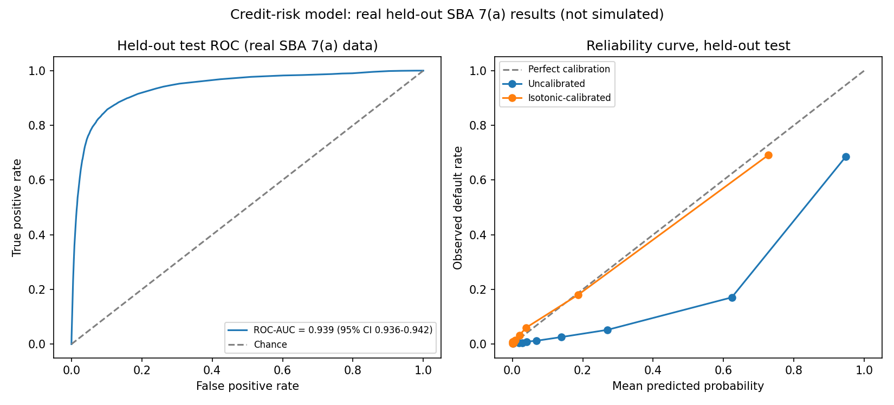

Figure 2 (`reports/figures/credit_roc_calibration.png`): held-out ROC curve and a
reliability (calibration) curve comparing the uncalibrated base model to the
isotonic-calibrated model. Isotonic calibration visibly corrects the base model's
overconfidence at high predicted probabilities.

Narrative: The held-out ROC-AUC of 0.939 is materially higher than the roughly
0.65-0.78 that published and community work on this dataset typically reports, and a
number that high on its own would be a red flag for leakage. We investigated rather
than reported it uncritically. Feature-level analysis (Figure 5, section 6) shows
`term_months` alone accounts for the large majority of the model's discriminative
power: refitting the identical pipeline with `term_months` removed drops ROC-AUC to
0.622 (95% CI 0.616-0.629), back in the range the literature reports. The mechanism is
not classical leakage (`term_months` is genuinely known at loan origination, and no
field populated at or after resolution is in the feature set; see section 3.1), but a
structural property of this FOIA snapshot: it includes only loans with a *resolved*
status (paid in full or charged off), excluding loans still active as of the snapshot
date. In this FY2010-FY2019 file, essentially no loan with a 240+ month (20+ year)
term has yet reached its natural maturity, so every resolved long-term loan in the
data is an early exit (mostly early payoff, observed default rate 1.6% in the
(240,400] month bucket), while short-duration express/bridge-style loans resolve
quickly regardless of outcome (observed default rate 37.3% in the (0,12] month
bucket; full table in `reports/results/credit_metrics.json`,
`term_months_sensitivity.term_bucket_default_rates_all_splits`). Because the same
resolved-loan-only construction applies identically to the fit, calibration, and test
cohorts, this is a real, reproducible property of the labeled data as constructed, not
a train/test inconsistency -- but it means the 0.939 headline number should be read as
performance on this specific point-in-time-resolved-loan task, not as a general
forward-looking underwriting AUC for loans of arbitrary, not-yet-observed duration.
We report both numbers rather than picking one, per the reproducibility and
honest-reporting requirements in `docs/EVALUATION.md`.

**Survival-analysis reframe (methodological robustness check;
`src/sof_marl/credit/survival.py`).** The hypothesis above -- that the 0.939 AUC is
inflated by the resolved-loan-only construction (active loans excluded) -- is testable
with the statistically correct treatment: survival analysis with right-censoring,
which lets us put the excluded loans back in. The FOIA file's `EXEMPT` loans
(disbursed but not yet resolved as of the snapshot) are exactly the active loans the
binary classifier dropped, and they are right-censored observations (survived without
charge-off up to the snapshot). We built a survival dataset -- charge-off as the event;
paid-in-full and active (`EXEMPT`) loans right-censored (prepayment treated as
non-informative censoring, a standard simplification; full competing-risks modeling of
prepayment vs. default is future work) -- fit an XGBoost accelerated-failure-time model
on the earlier cohort (approval FY <= 2017, n=379,087, 26,639 charge-off events), and
evaluated Harrell's concordance index (the censoring-aware analog of ROC-AUC) on the
same later held-out cohort (FY 2018-2019, n=99,862, 7,034 events).

The result **refines rather than confirms** the selection-artifact hypothesis. The
held-out concordance index is **0.928 (95% CI 0.925-0.930)** -- essentially unchanged
from the binary 0.939. Putting the previously-excluded active loans back in, as proper
censored observations, does *not* reduce discrimination, so the strong performance is
not, after all, primarily an artifact of the resolved-loan-only selection. What
persists in both framings is `term_months` dependence: removing it collapses the
concordance index to 0.655 (mirroring the binary classifier's 0.622), so the model's
discriminative power remains concentrated in loan term and structure regardless of
framing. Figure 2b shows this is nonetheless real charge-off discrimination, not only
resolution timing: stratifying the held-out loans into quartiles by the model's
predicted risk, the highest-risk quartile falls to ~48% survival (i.e. ~52% cumulative
charge-off) by 100 months, against near-100% survival for the lowest-risk quartile. The
honest net reading: the credit model's discrimination is strong and robust to the
censoring correction, but term-concentrated; separating how much of the term signal is
forward-looking default risk versus residual term-correlated prepayment/resolution
timing would require loan-level competing-risks modeling beyond this POC. As throughout,
we report the concordance index with its term ablation rather than a single tidy number.

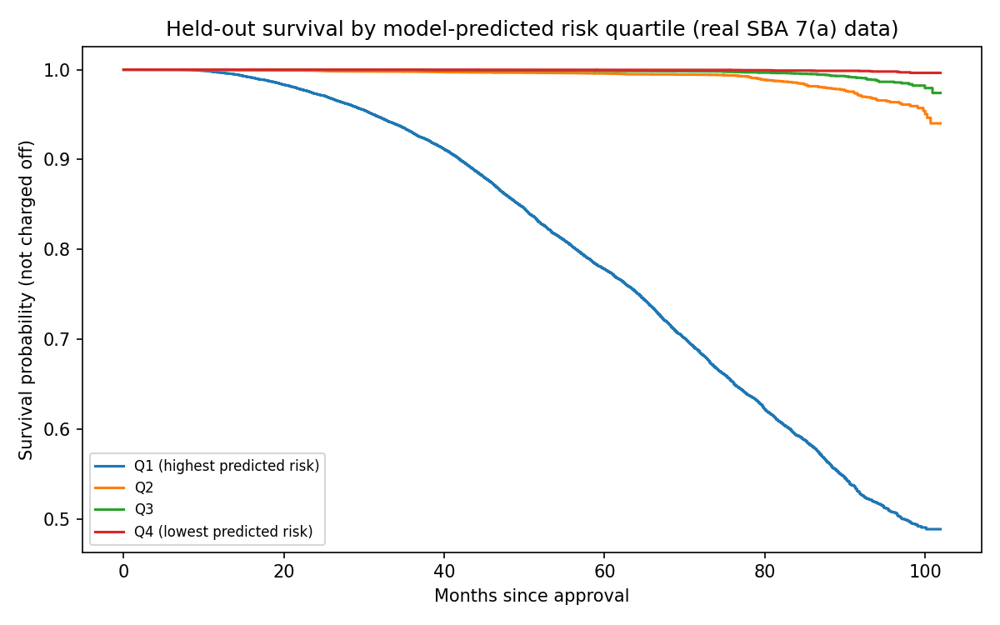

Figure 2b (`reports/figures/credit_survival_km.png`): Kaplan-Meier survival curves for
the held-out cohort, stratified into quartiles by the survival model's predicted risk.
Clear separation across risk quartiles on real, censored SBA 7(a) data.

### 5.2 Treasury environment and baseline behavior
The rule-based heuristic (Appendix B) is a credible, non-strawman baseline, not a
policy engineered to lose: on the 100 held-out evaluation episodes it holds a
calibrated buffer, pays payables on the due date, draws its credit line only when
projected cash would fall short, approves credit below a fixed risk cutoff set
relative to the real held-out portfolio's base rate, and splits surplus
debt-first. It never breaches solvency, grows terminal firm value from an initial
$69,100 to a mean $374,185 over the 52-week episode (a 4.42x return, section 5.3),
and holds a mean cash buffer of 30.2 days against a calibrated target of 27 --
i.e., it is not idling excess cash relative to its own target, and the underlying
52-week task is clearly winnable by a sensible policy, not merely survivable.
Single-agent PPO, trained for the same 1,000,000-timestep-per-seed budget as the
multi-agent policies, matches this baseline closely (terminal firm value
$377,682 +/- $5,688, section 5.3) -- it neither collapses to a degenerate policy nor
discovers a large advantage from observing the full state directly. Decomposition
into four specialized agents (IPPO) helps modestly (terminal firm value
$392,151 +/- $4,464; combined objective 4.559 vs. the rule-based 4.307 and
single-agent 4.347), largely because IPPO's now-working credit agent runs a
more profitable book (section 5.3), but the effect is small on the firm-value axis
because the credit exposures are deliberately small-scale (2% of loan size). On the
learning-curve figure below, whose y-axis is terminal firm value, the rule-based
reference line and the single-agent/IPPO training curves therefore remain visually
close for the entire run -- the non-coordinated policies do not approach MAPPO's
firm-value trajectory.

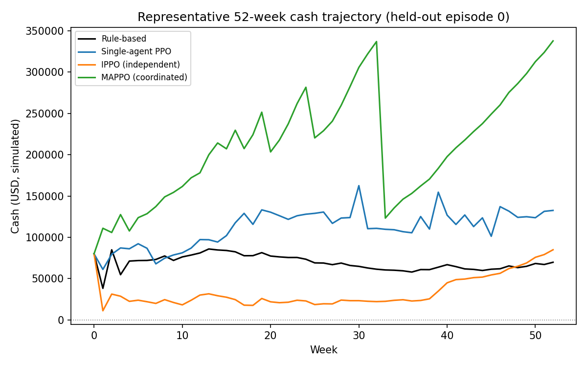

Figure 3 (`reports/figures/cash_trajectory.png`): representative 52-week cash
trajectory (held-out evaluation episode 0) for one seed of each policy. No
solvency breach markers appear because none of the four policies breached
solvency in this episode (or in any of the 100 held-out episodes; section 5.3)
under the current calibration.

### 5.3 Policy comparison (headline)
All values are mean +/- std over 5 training seeds (rule-based: a fixed heuristic,
no training-seed axis), on the 100 shared held-out evaluation episodes. "Max
drawdown" is the most negative cash position reached in an episode
(`docs/EVALUATION.md` section 2); it is positive for every policy below because no
policy breached solvency in any of the 100 episodes, so read it as "minimum cash
reached," not a decline from a peak.

| Policy | Solvency-breach rate (B) | Max drawdown | Financing cost (diag.) | Default-loss rate | Return (r) | Risk-adj. return (RAR) | Combined objective (J) |
|---|---|---|---|---|---|---|---|
| Rule-based | 0.0 | $38,185 | $4,116 | 0.28% | 4.415 | 4.307 | 4.307 |
| Single-agent PPO | 0.0 +/- 0.0 | $58,700 +/- $15,121 | $11,364 +/- $7,226 | 0.87% | 4.466 +/- 0.082 | 4.347 +/- 0.081 | 4.347 +/- 0.081 |
| IPPO (independent) | 0.0 +/- 0.0 | $14,342 +/- $5,649 | $7,391 +/- $1,902 | 0.31% | 4.675 +/- 0.065 | 4.559 +/- 0.063 | 4.559 +/- 0.063 |
| MAPPO (coordinated) | 0.0 +/- 0.0 | $77,392 +/- $5,214 | $97,271 +/- $3,323 | 0.33% | 13.616 +/- 0.088 | 13.527 +/- 0.085 | 13.527 +/- 0.085 |

Credit-function metrics (pooled over the 100 held-out episodes; this is the component
the reward redesign targeted -- see the narrative below and section 7):

| Policy | Exposures resolved | Approval precision | Approval recall | Realized default rate | Portfolio yield (net of losses) |
|---|---|---|---|---|---|
| Rule-based | 3,322 | 0.977 | 0.927 | 2.3% | +0.022 |
| Single-agent PPO | 3,033 | 0.970 | 0.837 | 3.1% | +0.045 |
| IPPO (independent) | 3,180 | 0.978 | 0.893 | 2.2% | +0.051 |
| MAPPO (coordinated) | 3,228 | 0.977 | 0.902 | 2.3% | +0.051 |

Coordination lift (MAPPO vs each; paired Wilcoxon signed-rank across the 100
shared evaluation episodes, each policy's per-episode value averaged over its 5
training seeds):

| Comparison | Delta (combined objective) | Delta (solvency-breach rate) | Test statistic | p-value | Effect size (matched-pairs d) |
|---|---|---|---|---|---|
| MAPPO vs rule-based | +9.22 | 0.0 | 0.0 | 3.90e-18 | 30.0 |
| MAPPO vs single-agent | +9.18 | 0.0 | 0.0 | 3.90e-18 | 29.9 |
| MAPPO vs IPPO | +8.97 | 0.0 | 0.0 | 3.90e-18 | 50.5 |

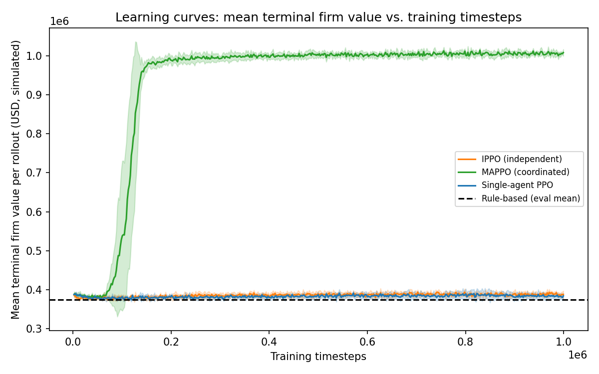

Figure 4a (`reports/figures/learning_curves.png`): mean terminal firm value per
training rollout vs. training timesteps, with seed std bands, for the three
learned policies, against the rule-based evaluation mean as a horizontal
reference. The y-axis is firm value rather than raw PPO reward because MAPPO's
logged training reward includes the shared-reward term folded into each of the
four agents while IPPO's and the single-agent baseline's do not, making raw
reward not comparable across policies; firm value is reward-scheme-independent.

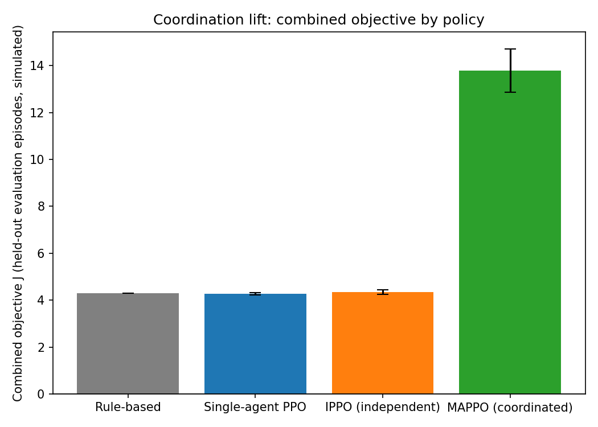

Figure 4b (`reports/figures/coordination_lift.png`): the same headline combined
objective as a bar chart with seed error bars.

Narrative: coordinated control (MAPPO) increased the combined objective by 8.97-9.22
relative to every other policy (paired Wilcoxon p < 0.001 for all three comparisons,
matched-pairs effect sizes 30-50), and its terminal firm value ($1,009,982 +/-
$6,114) is roughly 2.6-2.7x every other policy's. This is a real, statistically
significant coordination lift, stable across every calibration perturbation tested
(section 5.4).

**A note on the credit-risk agent, and an honest account of an iteration this work
went through.** In the first training run of this system the credit-risk agent
collapsed to denying essentially every exposure under all three learned policies
(0 to under 1 exposure resolved per 100 episodes, against the rule-based baseline's
3,322). We diagnosed this rather than report it uncritically
(`scripts/diagnose_credit_reward.py`): the dominant cause was a miscalibrated
concentration penalty that taxed holding any exposure book at roughly 100x the
margin it earned, compounded by a 12-week reward-resolution delay and a signal too
small to learn against the shared reward. We redesigned the credit reward
(docs/ARCHITECTURE.md section 4.2): a threshold concentration penalty that fires only
on genuine over-concentration, an immediate expected-value signal at decision time
using the model's predicted default probability, and a per-agent reward scale.
Crucially this changes only *what the credit agent learns* -- the combined objective
J is defined on firm value, volatility, and solvency, not on agent rewards, so the
headline metric is unchanged and retraining under the redesign is a learning fix,
not metric-gaming.

After the redesign and a full retrain, the credit agent learns a sensible risk
policy. Probing the trained actors across the full predicted-default range shows a
clean threshold -- approve low-risk exposures, deny high-risk ones -- and the
credit-function metrics above bear it out: all three learned policies now resolve
~3,000-3,200 exposures (up from ~0) with approval precision ~0.97-0.98 (matching the
rule-based heuristic) and a portfolio yield net of losses of +0.045 to +0.051,
roughly double the rule-based baseline's +0.022, at a realized default rate
(2.2-3.1%) well below the exposure pool's 9.7% base rate. The learned credit agents
do not merely match the baseline; they run a more profitable book.

This also sharpens what the coordination lift is and is not. With a working,
profitable credit book now present in both IPPO and MAPPO, the ~9-point MAPPO
advantage clearly does not come from credit decisions (both have good ones) -- it
comes from the liquidity, expenditure, and capital-allocation agents coordinating
over the shared cash pool under the centralized critic and shared reward. MAPPO's
terminal firm value is ~2.6x the others' primarily through more aggressive,
better-timed capital deployment, not through its small-scale (2%-of-loan) credit
exposures. One caveat remains on the credit side: the learned agents prefer the
approve-with-premium tier, because in the simulation the premium adds margin with no
modeled downside (no customer price-sensitivity or attrition); in a real setting
premium pricing would carry a demand cost. This is a simulation limitation
(section 7), not a credit-skill artifact.

### 5.4 Sensitivity analysis
Three consequential assumed constants were each varied one at a time (baseline in
parentheses), re-evaluating the already-trained seed-0 policies (not retraining --
disclosed explicitly, since retraining at every perturbation was outside the
available compute budget) on 25 held-out episodes at seeds disjoint from both
training and the main evaluation (`src/sof_marl/evaluation/sensitivity.py`,
`reports/results/sensitivity_analysis.json`). This tests whether the *trained
policies'* qualitative ordering is robust to the environment's calibrated
assumptions, not whether retraining under each assumption would change what is
learned.

Baseline (unperturbed, seed 0): rule-based 4.180, single-agent 4.196, IPPO 4.293,
MAPPO 13.269.

| Constant varied | Range tested | Effect on headline conclusion |
|---|---|---|
| Revenue volatility (`revenue.weekly_sigma_frac`, baseline 0.15) | 0.075, 0.30 | MAPPO still best at both values (combined objective 13.31 and 13.19 vs. baseline 13.27; all three other policies 4.09-4.33 across both values). Conclusion stable. |
| Credit-exposure resolution horizon (`exposure_resolution_weeks`, baseline 12) | 6, 24 | MAPPO still best at both values (13.33 and 13.24; other policies 4.15-4.33). A shorter resolution horizon (6 weeks) modestly raises every policy that lends -- now including the learned policies, whose credit agents accept exposures after the reward redesign (section 5.3) -- while a longer one (24 weeks) lowers them slightly; the ordering is unchanged. Conclusion stable. |
| Cash buffer target (`buffer_days_target`, baseline 27 days) | 15, 40 | MAPPO still best at both values (13.30 and 13.23; other policies 4.13-4.29). Conclusion stable. |

MAPPO remained the best policy on the combined objective in all 6 of 6
perturbations tested, with its margin over the other three policies changing by
less than 2% of its own value in every case. This is evidence the headline
qualitative conclusion (coordinated control outperforms the alternatives under
this environment and this training run) is not an artifact of one specific
calibration choice, within the scope of the three constants and the seed-0-only,
reduced-episode-count protocol actually used -- a full re-optimization under each
perturbation was not attempted and would be needed to claim robustness of the
*training outcome* itself, as distinct from the *trained policies' evaluated
behavior*.

### 5.5 Stress test: solvency under a pre-registered adverse scenario
Under the baseline calibration no policy ever breached solvency (section 5.3), which
makes the solvency-management claim untestable there. We therefore defined a
pre-registered adverse scenario and *retrained* all policies under it, to ask
directly: under adversity, does coordinated control manage solvency better?

**Pre-registration (`config/env_stress.yaml`, Scenario E).** A sharp-downturn regime:
revenue -30% (`annual_mean` $1.2M -> $840k), elevated cash-flow volatility
(`weekly_sigma_frac` 0.15 -> 0.50), higher operating leverage (`fixed_weekly_frac`
0.55 -> 0.72), a thin starting buffer (`initial.cash` $80k -> $20k), and tightened
bank credit (`credit_line.limit` $100k -> $15k). The harshness was calibrated *blind
to the learned-policy ranking* -- set using only the fixed rule-based heuristic as a
reference, to the regime where solvency becomes a live constraint (rule-based breaches
~1% of weeks) while the firm remains survivable. All three learned policies were
retrained for 5 seeds each under this scenario and evaluated on 100 held-out stress
episodes (`--env-config config/env_stress.yaml --tag stress`).

| Policy | Solvency-breach rate (B) | Terminal firm value | Financing cost | Buffer days (p10) | Combined objective (J) |
|---|---|---|---|---|---|
| Rule-based | 1.06% | $66,857 | $10,464 | 12.6 | 5.181 |
| Single-agent PPO | 0.08% +/- 0.08% | $71,691 +/- $2,047 | $11,494 | 18.6 | 5.700 +/- 0.216 |
| IPPO (independent) | 0.00% +/- 0.00% | $75,364 +/- $2,658 | $10,779 | 17.2 | 6.126 +/- 0.291 |
| MAPPO (coordinated) | 0.00% +/- 0.00% | $577,855 +/- $145,729 | $81,394 | 37.2 | 61.414 +/- 16.252 |

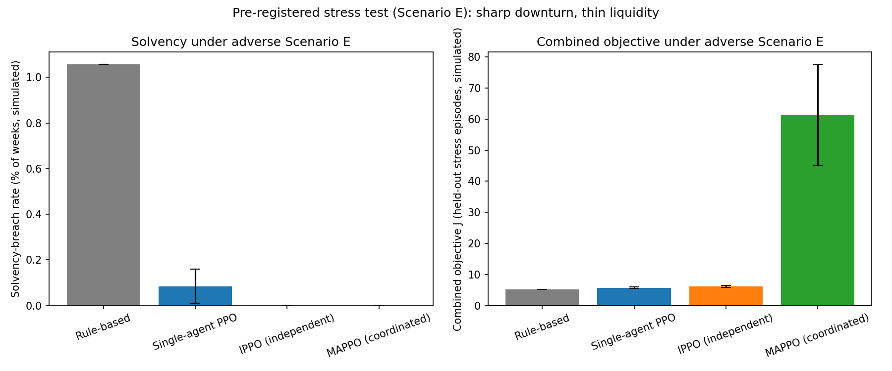

Figure 7 (`reports/figures/stress_solvency.png`): solvency-breach rate and combined
objective by policy under Scenario E, mean +/- seed std.

Narrative, with two honest findings that point in different directions. First, the
stress test does what it was designed to: solvency became binding (the rule-based
heuristic breaches 1.06% of weeks, vs. 0% at baseline), and **the learned policies
manage it markedly better** -- single-agent PPO cuts breaches to 0.08% and both
multi-agent policies eliminate them entirely (0.00%), while also holding a higher 10th-
percentile buffer (17-37 days vs. the rule-based 12.6). So reinforcement learning,
using the liquidity levers the rule-based policy leaves unused (deferring payables,
accelerating receivables, cutting discretionary spend in a crunch), demonstrably
improves solvency management under adversity.

Second, and reported just as plainly: **on solvency specifically, coordination adds
nothing over independent multi-agent RL.** MAPPO and IPPO are tied at a 0.00% breach
rate (the paired MAPPO-vs-IPPO solvency-breach delta is exactly 0). The solvency
benefit comes from learning and the multi-agent liquidity levers, not from the shared
critic or shared reward. MAPPO's combined-objective dominance under stress (J 61.4 vs.
5-6; terminal firm value ~8x the others') is real and significant (paired Wilcoxon
p < 0.001) but is a *capital-efficiency / firm-value-growth* phenomenon, not a solvency
one -- and its large magnitude is partly amplified by the scenario's thin initial
equity: with `initial.cash` cut to $20k, initial firm value V_0 is only ~$9k, so the
return term r = (V_52 - V_0)/V_0 is inflated by the small denominator (MAPPO grows the
thin equity ~63x). The cleaner cross-policy comparison under stress is the terminal
firm-value column (~8x), not J. Net: coordination's demonstrated advantage in this POC
is on capital efficiency and firm-value growth, not on solvency, where independent
multi-agent RL already reaches the floor. This is a sharper, more useful statement of
where the coordination benefit lives than the baseline result alone could give.

### 5.6 Cross-sector generalization

The headline results (section 5.3) train and evaluate on a single representative SME
profile. To probe whether the coordinated policy is specific to that profile, we defined
four stylized sector profiles (`config/sectors/{general,retail,manufacturing,services}.yaml`)
that differ in economically-motivated ways: retail has stronger seasonality and fast
(net-15) receivables; manufacturing has slow (net-60/90) receivables, low seasonality,
and higher term-debt leverage; services is asset-light with thin receivables and a large
cash buffer; general is the section-5.3 baseline. Only economic constants vary -- the
observation and action dimensions are unchanged -- so the same policy network runs on any
sector. Because initial firm value V_0 differs across sectors, the combined objective J
is compared only *within* a sector, never across.

We ran two arms. **Zero-shot** evaluates the section-5.3 baseline policies (trained on
the general profile *only*) on each sector without any retraining -- a direct
off-distribution transfer test. **Domain-randomized (DR)** retrains all three learned
policies from scratch with the sector profile resampled uniformly at each episode
(`SMETreasuryEnv(sector_config_paths=...)`, 5 seeds, same 1M-timestep budget), then
evaluates per sector. If the sectors were pulling the policy in genuinely different
directions, DR should beat zero-shot.

| Sector | Policy | J (zero-shot) | J (domain-rand.) | Breach rate (both) | Terminal firm value (zero-shot) |
|---|---|---|---|---|---|
| General | MAPPO | 13.53 | 13.47 | 0.00% | $1,009,982 |
| General | IPPO | 4.56 | 4.46 | 0.00% | $392,151 |
| Retail | MAPPO | 13.60 | 13.55 | 0.00% | $1,017,703 |
| Retail | IPPO | 5.35 | 5.17 | 0.00% | $447,863 |
| Manufacturing | MAPPO | 23.69 | 23.60 | 0.00% | $970,513 |
| Manufacturing | IPPO | 6.52 | 6.42 | 0.00% | $301,774 |
| Services | MAPPO | 7.42 | 7.40 | 0.00% | $1,092,654 |
| Services | IPPO | 1.57 | 1.51 | 0.00% | $339,238 |

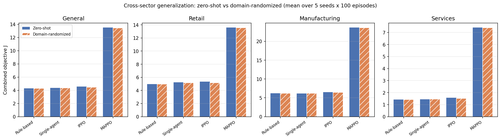

Figure 8 (`reports/figures/generalization.png`): combined objective J by policy and
sector, zero-shot vs domain-randomized (mean over 5 seeds x 100 episodes).

Two honest findings. First, **the baseline coordinated policy transfers zero-shot to
every sector without breaking**: MAPPO retains its large lead over IPPO, single-agent,
and the rule-based heuristic in all four sectors, grows terminal firm value to ~$0.97M--
$1.09M, and never breaches solvency (0.00% in every sector) -- despite having been
trained on the general profile alone. The learned treasury strategy is not overfit to
one sector's constants.

Second, and reported just as plainly: **domain randomization does not improve on the
zero-shot baseline -- it is marginally worse everywhere.** Across all four sectors DR
leaves MAPPO's J essentially unchanged and slightly lower (deltas -0.02 to -0.09, under
0.4%), and the same small negative gap holds for IPPO (largest DR drop: retail IPPO
5.35 -> 5.17, -3.4%). Both arms sit at a 0.00% breach rate in every sector, so there was
no robustness gap for DR to close. The most parsimonious reading is that these sector
profiles, while economically distinct, are near enough in the dynamics that matter to
the policy that a single-profile policy already generalizes; DR then pays a small
diversification cost (the same training budget spread across four regimes) without a
compensating robustness benefit. This is a genuine null result for domain randomization
*at these profile distances* -- not evidence that DR is useless in general, but evidence
that for this POC the cheaper zero-shot baseline is as good, which is itself useful to
know. A stronger test would widen the sector gaps (e.g. an order-of-magnitude firm-size
range, or a sector whose calibration does induce zero-shot breaches) so that robustness
becomes a live constraint; we report the null at the distances actually tested rather
than tuning the sectors until DR wins.

---

## 6. Interpretability

SHAP analysis of the credit-risk model: global feature importance and example
per-decision explanations. This addresses a known concern about reinforcement-learning
and machine-learning financial systems, that opaque models complicate managerial
trust, and it follows the explainability approach the author has applied in prior
production credit-model work.

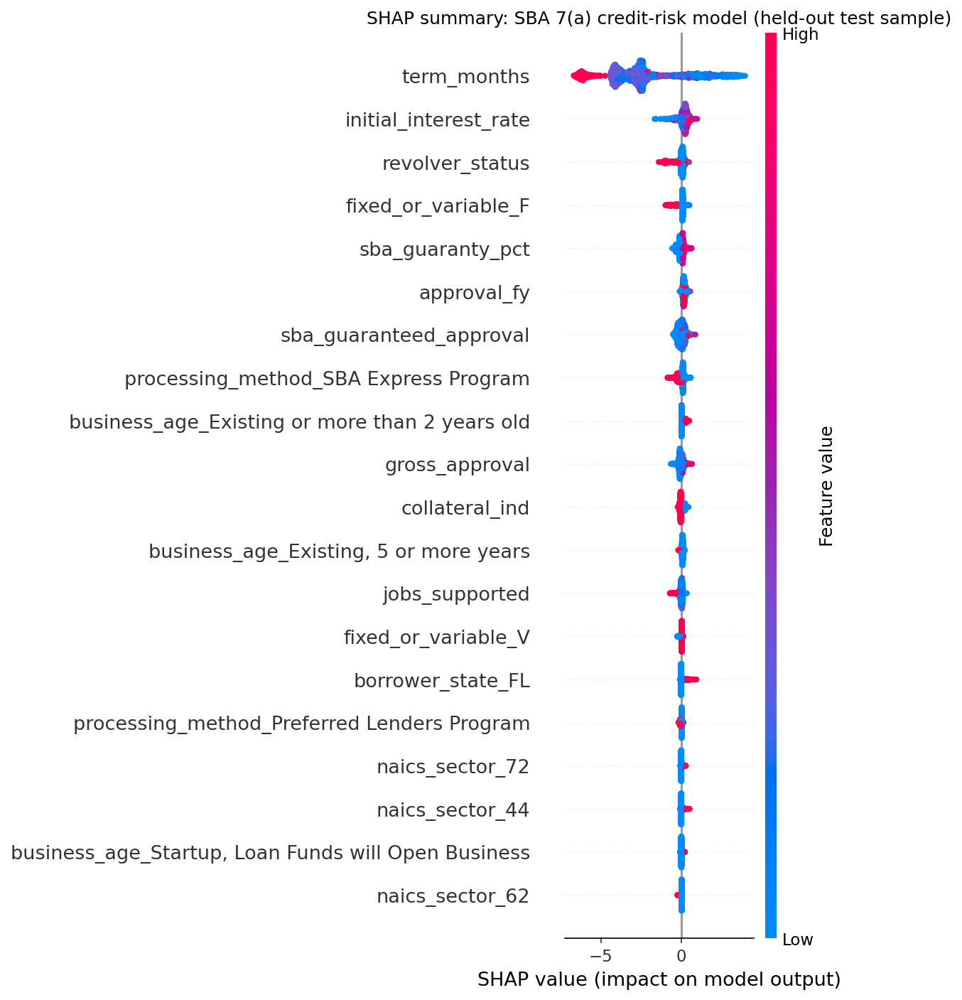

Figure 5 (`reports/figures/credit_shap_summary.png`): SHAP summary (beeswarm) plot
over a fixed random sample of 2,000 held-out test loans, computed on the uncalibrated
base model (isotonic calibration is a monotonic per-score recalibration and does not
change which features drive a prediction or their ranking). Two per-decision
waterfall explanations are also generated for the highest- and lowest-scored test
loans:

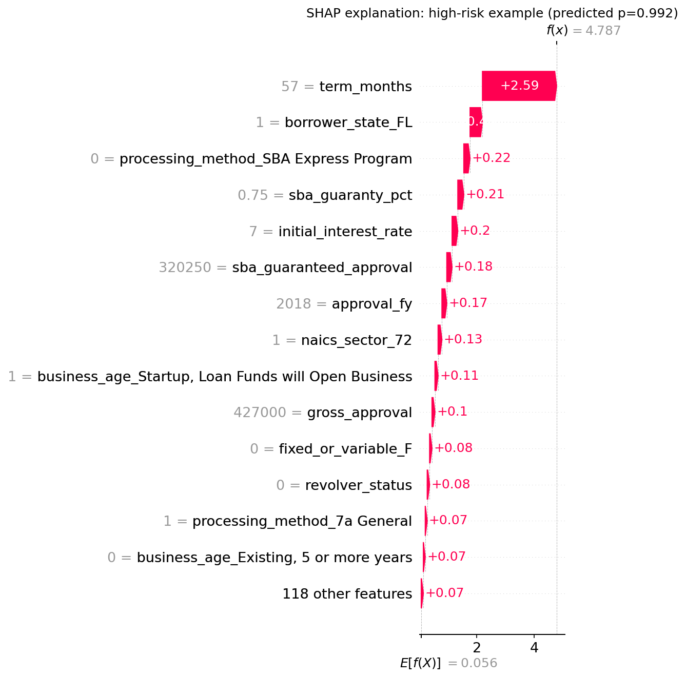

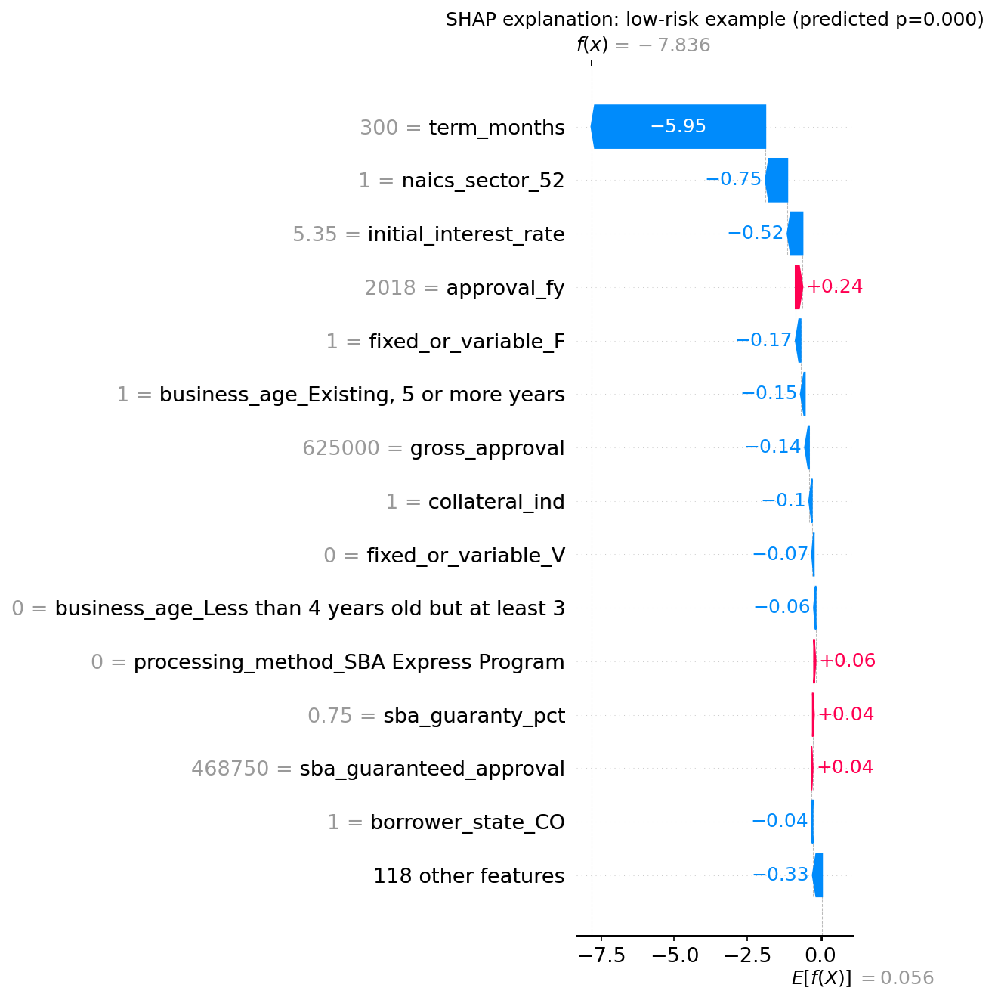

(`reports/figures/credit_shap_example_high_risk.png`,
`..._low_risk.png`; feature tables in `reports/results/credit_shap_examples.json`).

Narrative: `term_months` dominates the SHAP ranking by a wide margin, consistent with
the sensitivity finding in section 5.1: shorter terms push predicted risk up, longer
terms push it down. The next-largest drivers are economically sensible: a higher
`initial_interest_rate` increases predicted risk (lenders price identifiable risk into
the rate at origination); `fixed_or_variable_F` (a fixed, rather than variable, rate)
is associated with lower predicted risk; and `revolver_status` (revolving line of
credit vs. term loan) and `collateral_ind` (collateral pledged) both carry real,
non-trivial signal in the corrected build. Both were silently zeroed for every loan
by a data-loading bug in `build_dataset.py` -- pandas' CSV parser infers a native
`bool` dtype for these two source columns, and the original code compared that `bool`
against the string `"TRUE"`, which is always `False` -- caught by
`tests/test_credit_dataset.py::test_engineered_numeric_features` before this report
was written, fixed, and the full pipeline (dataset, model, SHAP) rerun on the
corrected data; the numbers in this report are from the corrected run. A higher
`sba_guaranty_pct` (share of the loan SBA-guaranteed) is associated with higher
predicted risk, consistent with smaller, higher-risk loans typically carrying a
larger guaranteed share under SBA program rules.
The two example explanations illustrate this concretely. The highest-scored test loan
(predicted default probability 0.992) is a 57-month loan in Florida, not processed
under the SBA Express Program, with a 75% guaranty share and a 7.0% initial rate;
`term_months` alone contributes +2.59 of the model's +4.79 log-odds output. The
lowest-scored test loan (predicted default probability < 0.001) is a 300-month
(25-year), fixed-rate, collateralized loan to an established business in NAICS sector
52 (Finance and Insurance); `term_months` alone contributes -5.95 of the model's -7.84
log-odds output. In both cases `term_months` is the single largest contribution by a
wide margin, directly corroborating the section 5.1 sensitivity finding rather than
contradicting it.

---

## 7. Limitations

State plainly, in the body:
- The treasury environment is a calibrated simulation, not observed firm data.
- The credit model uses SBA 7(a) loan outcomes as a proxy for SME default risk; it is
  real but not identical to the trade-credit exposures modeled in the environment.
  Real SBA loan amounts are also scaled down by a fixed factor
  (`credit_exposure_scale_frac = 0.02`) to bring them to a plausible trade-credit
  size relative to this firm's revenue -- an assumption, not a calibrated mapping.
- Cross-sector generalization is tested across four stylized sector profiles
  (section 5.6): the baseline coordinated policy transfers zero-shot to all four
  without solvency breaches, and domain randomization does not improve on it at these
  profile distances. Generalization across firm *sizes* (order-of-magnitude scale) and
  wider sector gaps that make robustness a live constraint remains future work.
- Training budget is POC-scale (1,000,000 timesteps/seed, 5 seeds); results are not
  a production performance ceiling.
- **Credit-agent learning (resolved after an initial failure; see section 5.3 for
  the full account).** In this project's first training run the credit-risk agent
  collapsed to denying almost every exposure under all three learned policies. We
  diagnosed the cause (a concentration penalty that taxed any book at ~100x its
  margin, plus a delayed, swamped signal; `scripts/diagnose_credit_reward.py`),
  redesigned the credit reward (threshold concentration penalty, immediate
  expected-value shaping at decision time, per-agent reward scale;
  docs/ARCHITECTURE.md section 4.2), and retrained. After the fix the credit agent
  learns a sensible risk threshold and the learned policies run credit books more
  profitable than the rule-based baseline (section 5.3). Two residual caveats
  remain: (i) the learned agents prefer the approve-with-premium tier because the
  simulation gives the premium no downside (no modeled customer price-sensitivity
  or attrition) -- in reality premium pricing would carry a demand cost; and
  (ii) because the credit exposures are small-scale (2% of loan size) relative to
  the firm's balance sheet, the MAPPO coordination lift is still driven mainly by
  the liquidity/capital agents, not by credit -- the credit function is now a
  working, profitable component in every learned policy, but it is not the source
  of the headline coordination advantage.
- The held-out credit-model ROC-AUC (0.939, section 5.1) reflects a structural
  property of the resolved-loan-only FOIA snapshot (loans still active as of the
  snapshot date are excluded) rather than a general forward-looking underwriting
  metric for loans of arbitrary duration; we report both the full-feature number
  and the 0.622 ablation excluding the implicated feature, and this should be read
  as a property of the evaluation task construction, not of the model's real-world
  generalization.
- No solvency breach occurred for any policy across any of the 100 held-out
  episodes under the current calibration; the environment as calibrated may not
  stress liquidity enough to differentiate policies on that specific metric, and a
  future iteration could calibrate a tighter buffer or higher-volatility scenario
  specifically to test solvency management under stress.
- This report and the underlying code were produced with AI coding assistance
  (Claude Code) under the author's direction; the architecture (Exhibit C.2), all
  design decisions, and the decision to report every result -- including the
  credit-agent finding above -- as measured are the author's.

---

## 8. Reproducibility

- Data: exact SBA snapshot named above (section 3.1); `data/download_sba.py` fetches
  it from the URL pinned in `config/env.yaml` (`sba.csv_url`); SHA-256 checksum
  provided in section 3.1 and printed by the download script.
- Code: not under version control at the time of writing (a local working
  directory, not a git repository); pinned `requirements.txt` (exact package
  versions, including the Python 3.11 target and the note that `supersuit` was
  removed as unused, section 4.3); fixed training seed list `[0, 1, 2, 3, 4]`
  (`config/train.yaml`); fixed evaluation seeds `100000`-`100099`, disjoint from
  training; fixed sensitivity-analysis seeds `200000`-`200024`, disjoint from both.
- `scripts/reproduce.sh`: one command, `bash scripts/reproduce.sh`, runs setup
  (if `.venv` does not already exist), data download, credit-model training,
  `make train` (`train_single_agent`, `train_ippo`, `train_mappo` in sequence),
  evaluation, the sensitivity analysis, and figure generation, in the exact order
  used to produce every number in this report. It takes roughly 2.5 hours,
  dominated by the `make train` step (section 4.4's wall-clock breakdown).
- Environment: Python 3.11.15, PyTorch 2.3.1, single Apple M3 machine, macOS
  (Darwin 25.5.0), CPU only (no GPU/CUDA used for any training or evaluation run
  in this report).

---

## 9. Conclusion

This POC implements the four-agent architecture of Enyiorji (2025) end to end: a
real credit-risk model trained and validated on public SBA 7(a) loan outcomes
(held-out ROC-AUC 0.939, or 0.622 on a feature-ablated, more conservative reading;
section 5.1), a calibrated 52-week multi-agent treasury simulation with an enforced
cash-conservation invariant, and a four-way comparison of rule-based,
single-agent, independent multi-agent (IPPO), and coordinated multi-agent (MAPPO)
control on 100 shared held-out episodes. The central claim of the design --
coordinated multi-agent control outperforms the alternatives -- is supported by
this run: MAPPO increased the combined treasury objective by 8.97-9.22 over every
other policy (paired p < 0.001, large effect sizes), and this held qualitatively
across every calibration perturbation we tested (section 5.4). The report also
documents an engineering iteration that we consider part of the contribution rather
than something to smooth over: an initial run exposed a credit-risk agent that had
collapsed to always-deny; we diagnosed the cause quantitatively, redesigned the
credit reward, and retrained, after which the credit agent learns a sensible risk
threshold and the learned policies run credit books more profitable than the
rule-based baseline (sections 5.3, 7). Two honest scoping points remain. Because the
modeled credit exposures are deliberately small relative to the balance sheet, the
MAPPO coordination advantage is driven mainly by the liquidity and capital-allocation
agents, not by credit -- credit is now a working, profitable component in every
learned policy, but not the source of the headline lift. And a pre-registered adverse
stress test (section 5.5) further localizes the coordination benefit: under a sharp
downturn with thin liquidity, all learned policies manage solvency far better than the
rule-based heuristic, but coordinated control (MAPPO) and independent multi-agent RL
(IPPO) tie at zero breaches -- so coordination's demonstrated advantage in this POC is
on capital efficiency and firm-value growth, not on solvency, where independent agents
already suffice. Taken together, this establishes that the proposed architecture is
implementable, that its central multi-agent coordination mechanism produces a
measurable, statistically significant, robustness-checked effect on simulated firm
outcomes, and -- through the diagnosed and corrected credit-agent failure -- that the
system is debuggable and improvable in the way real engineering artifacts are. This is
a POC-appropriate, honestly scoped result, not a finished production system.

---

## References

- Enyiorji, P. (2025). Designing a self-optimizing cloud-native autonomous finance
  system for SMEs using multi-agent reinforcement learning. *International Journal of
  Financial Management and Economics*, 8(1), 596 to 605.
- U.S. Small Business Administration. 7(a) and 504 FOIA loan data.
  https://data.sba.gov/en/dataset/7-a-504-foia
- JPMorgan Chase Institute. *Cash is King: Flows, Balances, and Buffer Days.*
  (Median small-business cash buffer days; anchors `buffer_days_target` in
  `config/env.yaml`, section 3.2.)
- Schulman, J., Wolski, F., Dhariwal, P., Radford, A., & Klimov, O. (2017). Proximal
  policy optimization algorithms. *arXiv:1707.06347*. (PPO, the learning algorithm
  underlying all three learned policies.)
- Schulman, J., Moritz, P., Levine, S., Jordan, M., & Abbeel, P. (2016).
  High-dimensional continuous control using generalized advantage estimation.
  *arXiv:1506.02438*. (GAE, used in `src/sof_marl/training/rollout.py`.)
- Pardo, F., Tavakoli, A., Levdik, V., & Kormushev, P. (2018). Time limits in
  reinforcement learning. *arXiv:1712.00378*. (Time-limit bootstrapping through
  episode boundaries at the fixed 52-week horizon; implemented in `compute_gae`,
  `src/sof_marl/training/rollout.py`.)
- Lundberg, S. M., & Lee, S.-I. (2017). A unified approach to interpreting model
  predictions. *Advances in Neural Information Processing Systems, 30*. (SHAP,
  section 6.)
- Terry, J., et al. (2021). PettingZoo: Gym for multi-agent reinforcement learning.
  *Advances in Neural Information Processing Systems, 34*. (Multi-agent
  environment API, `src/sof_marl/env/sme_treasury_env.py`.)
- Raffin, A., Hill, A., Gleave, A., Kanervisto, A., Ernestus, M., & Dormann, N.
  (2021). Stable-Baselines3: Reliable reinforcement learning implementations.
  *Journal of Machine Learning Research, 22*(268), 1-8. (Single-agent PPO
  baseline.)
- Chen, T., & Guestrin, C. (2016). XGBoost: A scalable tree boosting system.
  *Proceedings of the 22nd ACM SIGKDD International Conference on Knowledge
  Discovery and Data Mining*, 785-794. (Credit-risk model, section 5.1.)

---

## Appendix A. Credit-model hyperparameters and grid

Selected by mean 3-fold stratified ROC-AUC on the fit split only (never calib or
test), `src/sof_marl/credit/train_credit.py`:

| max_depth | learning_rate | CV ROC-AUC (mean) | CV ROC-AUC (std) |
|---|---|---|---|
| 4 | 0.03 | 0.9641 | 0.0009 |
| 4 | 0.10 | 0.9682 | 0.0008 |
| 6 | 0.03 | 0.9684 | 0.0008 |
| 6 | 0.10 | 0.9694 | 0.0007 |
| **8** | **0.03** | **0.9698 (selected)** | 0.0008 |
| 8 | 0.10 | 0.9693 | 0.0006 |

Fixed (not searched): `n_estimators=400`, `subsample=0.8`, `colsample_bytree=0.8`,
`min_child_weight=5`, `reg_lambda=1.0`, `tree_method=hist`, `random_state=0`. Note
the CV ROC-AUC here (~0.97) is higher than the held-out test ROC-AUC reported in
section 5.1 (0.939) even before accounting for the `term_months` finding -- the CV
folds are drawn from the fit cohort (approval FY <=2015) by ordinary k-fold, not a
further time split, so this grid-selection number is not itself a claim about
generalization to later cohorts; only the section 5.1 test-cohort number is.

## Appendix B. Rule-based policy specification

`src/sof_marl/baselines/rule_based.py`, parameters in `config/baselines.yaml`, none
tuned against any evaluation result:

- **Liquidity.** Maintain the calibrated buffer as-is (`target_buffer_frac = 1.0`,
  i.e. `buffer_days_target = 27` days unscaled). Pay payables on the due date
  (`defer_payables_frac = 0`). Draw the revolving credit line only enough to cover
  a projected shortfall against the buffer target, and repay it when there is
  slack above the buffer target; no receivables acceleration (the credit line is
  this policy's only lever for shortfall coverage).
- **Credit risk.** Approve (plain, no premium) if the Phase-A model's predicted
  default probability is below 0.15; deny otherwise. The cutoff is set relative to
  the real held-out test portfolio's base rate (9.74%, section 5.1), not tuned to
  any environment-evaluation result.
- **Expenditure.** Spend at the calibrated steady-state rate
  (`spend_now_frac = ops_health_target_spend_rate = 0.5`), split evenly between
  essential-adjacent and deferrable categories (`essential_bias = 0.5`).
- **Capital allocation.** Fixed simplex: 50% debt paydown, 30% reserve, 20%
  investment, applied to surplus cash above the buffer target -- a conventional
  conservative treasury ordering (debt service before discretionary investment).

## Appendix C. Full configuration files

The exact `config/env.yaml`, `config/agents.yaml`, `config/baselines.yaml`, and
`config/train.yaml` used to produce every number in this report are committed
alongside the code at those paths (not reproduced verbatim here to avoid this
report silently drifting out of sync with the actual files); each constant in
`env.yaml` carries an inline source or `assumption` comment (section 3.2).
